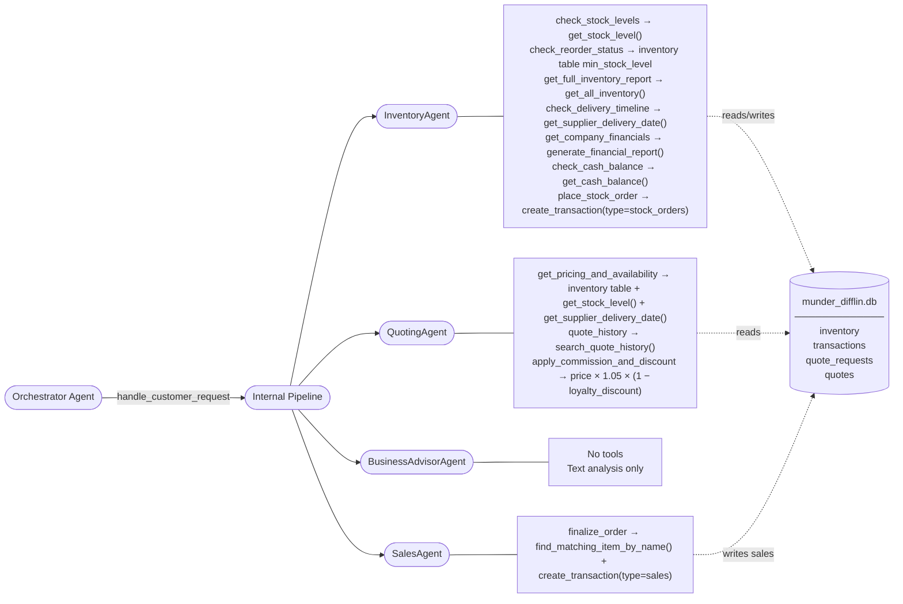

# Munder Difflin Multi-Agent System — Flow Diagram

## Orchestrator Perspective

```mermaid
flowchart TD
    START([Customer Request\n+ request_date]) --> ORCH

    ORCH["**Orchestrator Agent**\n─────────────────\nTool: handle_customer_request\nSystem prompt: format final\ncustomer-facing response"]

    ORCH -->|"calls handle_customer_request\ncustomer_request, as_of_date"| S1

    subgraph PIPELINE ["handle_customer_request  —  internal orchestration pipeline"]
        direction TB

        S1["Step 1–2\nNormalize text to lowercase\nExtract customer_deadline via regex"]
        S1 --> S4

        S4["Step 3–4\nKeyword classify:\nis_inquiry · is_quote · is_purchase"]
        S4 --> S5

        S5["Step 5  —  Item Extraction\nRegex pairs: qty + item_candidate\nfind_matching_item_by_name per candidate"]
        S5 --> S5_BRANCH{Catalog match?}

        S5_BRANCH -->|"Yes"| RESOLVED["items_mentioned\nquantities_mentioned"]
        S5_BRANCH -->|"No"| UNRESOLVED["unresolved_items\n→ status: N/A"]

        RESOLVED --> S6
        UNRESOLVED --> S7A

        subgraph S6 ["Step 6  —  InventoryAgent  ·  TASK TYPE: INQUIRY"]
            direction LR
            IA1(["inventory_agent.run()"]) --> IA_T["Tool called by agent:\ncheck_stock_levels\n─────────────────\nOther tools available\nbut not called in INQUIRY:\ncheck_reorder_status\nget_full_inventory_report\ncheck_delivery_timeline\nget_company_financials\ncheck_cash_balance\nplace_stock_order"]
            IA_T --> IA_OUT["Output: inventory_details JSON\nitem_name · qty_requested\ncurrent_stock · status\nAvailable / Insufficient / N/A"]
        end

        S6 --> S7["Step 7  —  Parse inventory_details JSON\nregex + json.loads"]
        S7 --> S7A

        S7A["Step 7a  —  In-process\nAppend unresolved_items\nas status: N/A\nno restock possible"]
        S7A --> S7B_CHK{Any Insufficient\nAND deadline exists?}

        S7B_CHK -->|"No"| S8
        S7B_CHK -->|"Yes"| S7B

        subgraph S7B ["Step 7b  —  Proactive Restock  ·  In-process logic"]
            direction TB
            R1["Per insufficient item:\nqty_needed = qty_requested × 1.1\nget_supplier_delivery_date\ncustomer_delivery_date = supplier arrival"]
            R1 --> R2{delivery ≤\ncustomer_deadline?}
            R2 -->|"No"| R_SKIP["Keep Insufficient\nskip item"]
            R2 -->|"Yes"| R3["get_cash_balance\nSELECT unit_price FROM inventory\norder_cost = unit_price × qty"]
            R3 --> R4{cash_balance\n≥ order_cost?}
            R4 -->|"No"| R_SKIP
            R4 -->|"Yes"| R5

            subgraph R5 ["InventoryAgent  ·  TASK TYPE: RESTOCK ORDER"]
                IA2(["inventory_agent.run()"]) --> IA2_T["Tool called by agent:\nplace_stock_order\n─────────────────\nAgent also calls internally:\nget_company_financials\ncheck_cash_balance\nbefore each place_stock_order"]
            end

            R5 --> R6["In-process re-check:\nget_stock_level per item\nUpdate inventory_details:\ncurrent_stock · status\nestimated_delivery_date"]
        end

        S7B --> S8

        subgraph S8 ["Step 8  —  QuotingAgent"]
            direction LR
            QA(["quoting_agent.run()"]) --> QA_T["Tools called by agent:\n1. quote_history  ← once per request\n   search_quote_history → quotes + quote_requests tables\n   → decide loyalty discount 0.0–0.03\n\n2. get_pricing_and_availability  ← per item\n   unit_price from inventory table\n   get_stock_level · get_supplier_delivery_date\n   ⚠ delivery date override if item was restocked in Step 7b\n\n3. apply_commission_and_discount  ← per item\n   price × 1.05 × (1 − loyalty_discount)"]
            QA_T --> QA_OUT["Output: quote_details JSON\nitem_name · qty_requested · current_stock\nunit_price · total_price\nestimated_delivery_date · status"]
        end

        S8 --> S9["Step 9  —  Parse quote_details JSON\nregex + json.loads"]
        S9 --> S10

        subgraph S10 ["Step 10  —  BusinessAdvisorAgent  ·  No tools"]
            BA(["business_advisor_agent.run()"]) --> BA_IN["Input:\ninventory_details + quote_details\n+ customer_deadline"]
            BA_IN --> BA_RULES["Decision per item:\nAvailable + stock ≥ qty → FINALIZE_ORDER\nInsufficient + delivery ≤ deadline → REORDER_STOCK\nN/A or delivery misses deadline → CANNOT_FULFILL"]
            BA_RULES --> BA_OUT["Output: business_analysis_details JSON\nitem_name · qty_requested · current_stock\nunit_price · total_price\nestimated_delivery_date · customer_deadline\nstatus · action"]
        end

        S10 --> S11["Step 11a  —  Parse business_analysis_details JSON\nregex + json.loads\nPartition into finalize_items · reorder_items · cannot_items"]

        S11 --> FIN_CHK{finalize_items\nnot empty?}
        FIN_CHK -->|"Yes"| S11B

        subgraph S11B ["Step 11b  —  SalesAgent"]
            SA(["sales_agent.run()"]) --> SA_T["Tool called by agent:\nfinalize_order per item\n─────────────────\nfind_matching_item_by_name\ncreate_transaction type=sales\nquantity × unit_price = total"]
            SA_T --> SA_OUT["Output: sales confirmation\nTransaction ID per item"]
        end

        S11 --> ORD_CHK{reorder_items\nnot empty?}
        ORD_CHK -->|"Yes"| S11C

        subgraph S11C ["Step 11c  —  InventoryAgent  ·  TASK TYPE: RESTOCK ORDER"]
            IA3(["inventory_agent.run()"]) --> IA3_T["Tool called by agent:\nplace_stock_order per item\n─────────────────\nAgent also calls internally:\nget_company_financials\ncheck_cash_balance\nbefore each place_stock_order"]
            IA3_T --> IA3_OUT["Output: restock confirmations\nTransaction ID per item"]
        end

        S11 --> CAN_CHK{cannot_items\nnot empty?}
        CAN_CHK -->|"Yes"| S11D["Build cannot-fulfill message\nlist item names"]

        S11B --> S12
        S11C --> S12
        S11D --> S12
        FIN_CHK -->|"No"| S12
        ORD_CHK -->|"No"| S12
        CAN_CHK -->|"No"| S12

        S12["Step 12  —  Assemble response\njoin sales + restock + cannot-fulfill parts\nIf no parts → 'No actionable items found'"]
    end

    PIPELINE --> ORCH
    ORCH --> END(["Final Response to Customer\n────────────────────────\nConfirmed items section\nRestocked items section\nCannot-fulfill section"])
```



---

## Agent Tool Map



---

## InventoryAgent — Called 3 Times Per Request (When Needed)

| Call | Step | Task Type | Tools Actually Used |
|------|------|-----------|---------------------|
| 1st | Step 6 | INQUIRY | `check_stock_levels` per item |
| 2nd | Step 7b | RESTOCK ORDER | `place_stock_order` (+ `get_company_financials`, `check_cash_balance` internally) |
| 3rd | Step 11c | RESTOCK ORDER | `place_stock_order` (+ `get_company_financials`, `check_cash_balance` internally) |

---

## Key Decision Points

| Decision | Step | True → | False → |
|---|---|---|---|
| Item in catalog? | Step 5 | resolved item | unresolved → N/A |
| Any Insufficient + deadline? | Step 7b | attempt proactive restock | skip to Step 8 |
| Delivery ≤ deadline? | Step 7b | check cash | keep Insufficient |
| Cash ≥ order cost? | Step 7b | place restock order | keep Insufficient |
| BA action = FINALIZE? | Step 11b | call SalesAgent | skip |
| BA action = REORDER? | Step 11c | call InventoryAgent | skip |
| BA action = CANNOT? | Step 11 | add to cannot-fulfill message | skip |

---

## Pricing Formula

```
final_unit_price = unit_price × 1.05 × (1 − loyalty_discount)
```
- `unit_price` — from `inventory` table
- `1.05` — fixed 5% sales commission
- `loyalty_discount` — 0.0–0.03 based on `quote_history` search
