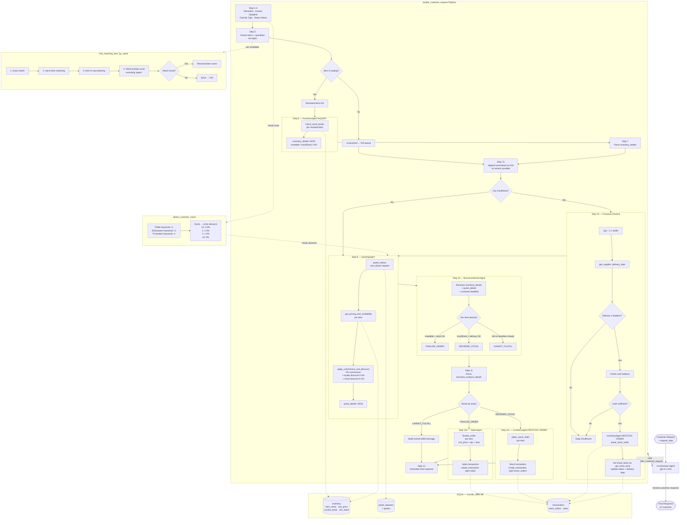
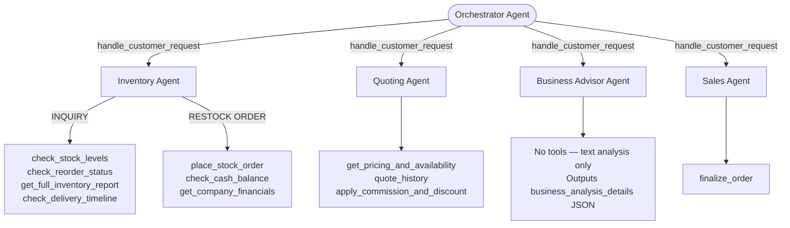

# Munder Difflin Multi-Agent System — Flow Diagram



---

## Agent Hierarchy



---

## Key Decision Points

| Decision | Location | Outcome |
|---|---|---|
| Item in catalog? | Step 5 — `find_matching_item_by_name` | Resolved → inventory check / Unresolved → N/A |
| Sufficient stock? | Step 7 — inventory_details | Available → quote / Insufficient → proactive restock attempt |
| Delivery ≤ deadline? | Step 7b — proactive restock | Yes → try restock / No → keep Insufficient |
| Cash sufficient? | Step 7b — cash check before restock | Yes → place order / No → keep Insufficient |
| BA action? | Step 10 — BusinessAdvisorAgent | FINALIZE → SalesAgent / REORDER → InventoryAgent / CANNOT → message |
| Mood score? | Step 4 — `detect_customer_mood` | Extra discount 0–2% added to quoting agent |

## Pricing Formula

```
final_unit_price = unit_price × 1.05 × (1 − loyalty_discount − mood_discount)
```
